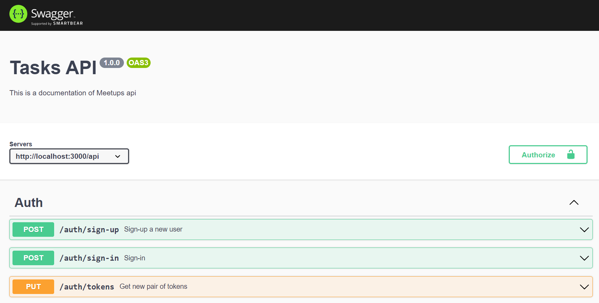

# Meetup API

## Функционал Web API
1. Получение списка всех митапов;
2. Получение определённого митапа по его Id;
3. Регистрация нового митапа;
4. Изменение информации о существующем митапе;
5. Удаление митапа.

## Информация о митапе
1. Название / тема;
2. Описание;
3. Набор тегов / ключевых слов;
4. Время и место проведения.

## Стек
1. [Node.js](https://nodejs.org/en/);
2. [Express](https://expressjs.com/ru/);
3. [PostgreSQL 14](https://www.postgresql.org/download/).

## Дополнительная работа
1. Валидация DTO (достаточно будет использовать joi).
2. Переработать запрос на получение списка митапов так, чтобы с его помощью можно было осуществить поиск по митапам, отфильтровать их, отсортировать. Результат также должен быть разбит на страницы.
3. Добавить документацию к API через Swagger.
4. Система аутентификации (предлагается к использованию библиотека PassportJS):

    - Пользователь регистрируется, авторизуется (получая JWT Access Token).
    Используя Access Token можно получить информацию о владельце токена
    (т.е. получить текущего пользователя по swagger.pngтокену) и записаться на митап.

    - Добавить персистентный JWT Refresh Token.

    - Разделить авторизованных пользователей на 2 типа: обычные пользователи
    (описаны в пунке 3.a) и организаторы митапов (только они могут
    регистрировать новые митапы, редактировать/удалять зарегистрированные
    ими митапы)

    Подробно с предоставленным api вы можете ознакомится в документации по следующей ссылке - https://localhost:{your_port}/api/docs

    